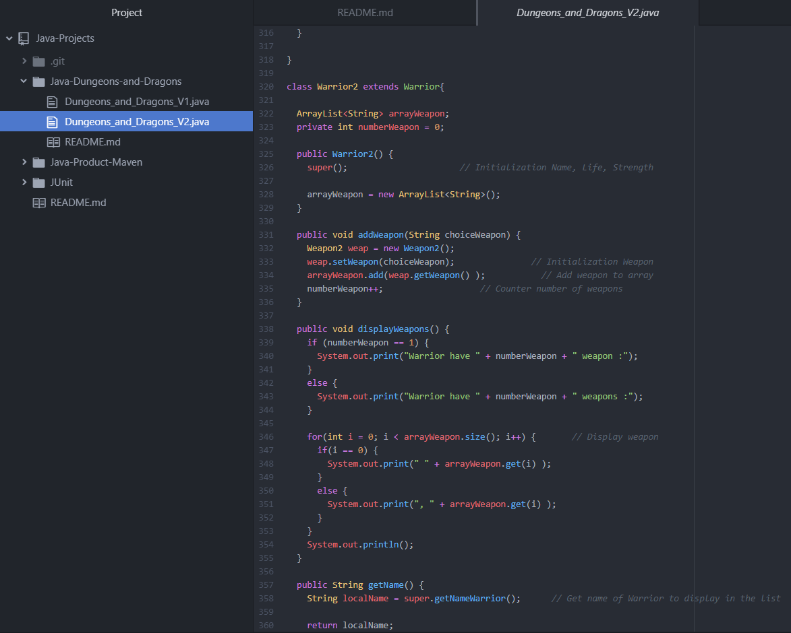
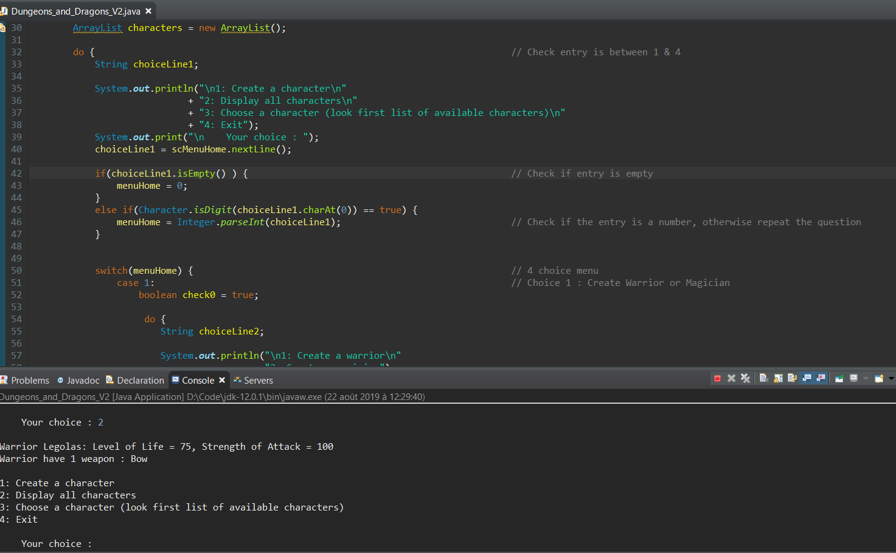
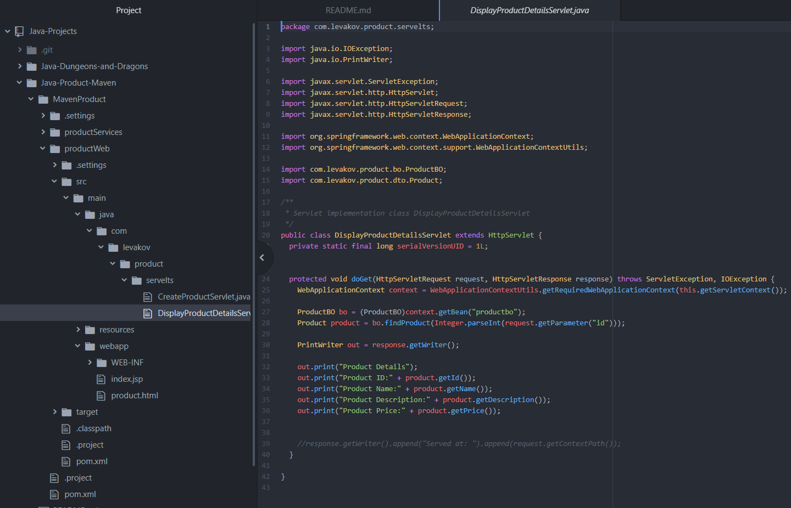
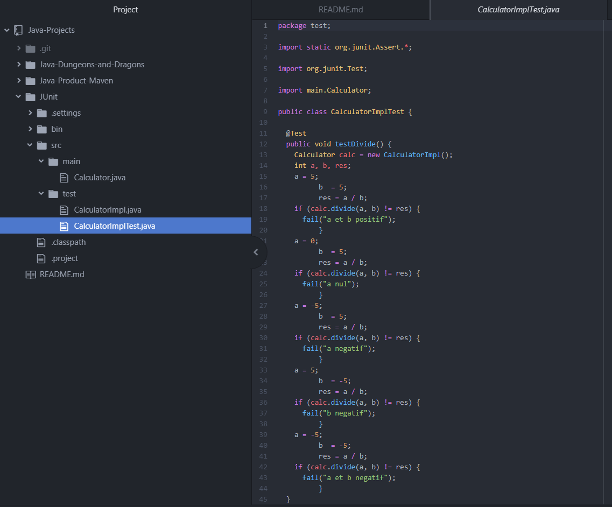

# Java-Projects

	- Simulating character creation for D&D
		Object-Oriented Programming, Inhéritance, Collections

	- Product Database
		Maven, Servlets, Interfaces

	- Unit Tests
		JUnit, Interfaces

